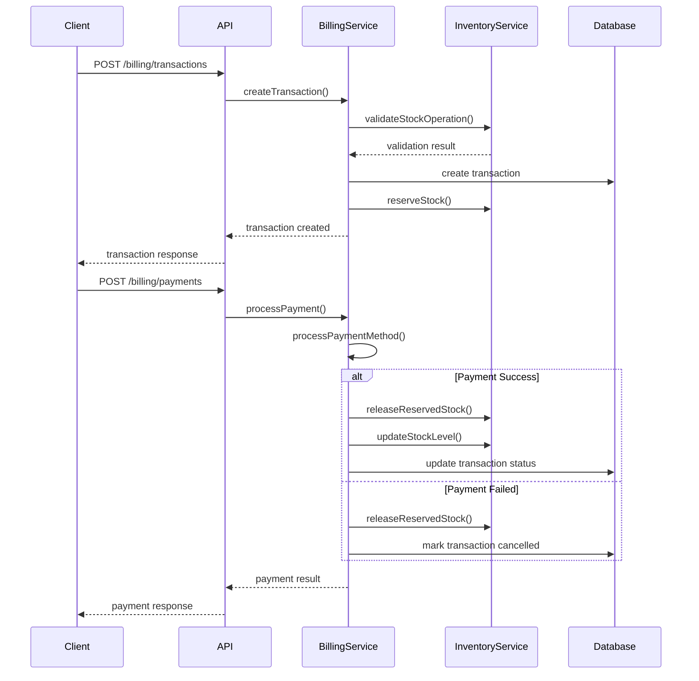

# Multi-Tenant Point of Sale and Billing System

## Overview

The Multi-Tenant Point of Sale and Billing System provides comprehensive transaction processing, payment integration, receipt generation, and sales analytics with complete tenant isolation. This system is designed for retail environments where multiple businesses need independent billing operations.

## Key Features

### 1. Transaction Processing
- Multi-item transaction creation with automatic calculations
- Tax calculation based on tenant configuration
- Discount application at item and transaction level
- Inventory reservation during transaction processing
- Real-time inventory updates on completion

### 2. Payment Integration
- Multiple payment method support (Cash, Credit/Debit Cards, Digital Wallets)
- Mock payment processing with extensible architecture
- Payment status tracking and confirmation
- Automatic inventory adjustment on payment success/failure

### 3. Receipt Generation
- Multiple format support (JSON, HTML, PDF)
- Tenant branding integration
- QR code generation for digital receipts
- Professional receipt templates

### 4. Refund Processing
- Partial and full refund support
- Automatic inventory adjustment for returned items
- Refund tracking and audit trail
- Multiple refund methods (original payment, cash, store credit)

### 5. Sales Analytics
- Real-time sales metrics (today, week, month, year)
- Top-selling products analysis
- Average order value calculations
- Sales trend analysis and growth rates

### 6. Tenant Isolation
- Complete data separation between tenants
- Location-based access control
- Tenant-specific tax configurations
- Independent discount rules per tenant

## API Endpoints

### Transaction Management

#### Create Transaction
```http
POST /api/v1/billing/transactions
```

**Request Body:**
```json
{
  "locationId": "string",
  "customerId": "string (optional)",
  "items": [
    {
      "productId": "string",
      "quantity": 2,
      "unitPrice": 29.99,
      "discountAmount": 2.00
    }
  ],
  "paymentMethod": "CREDIT_CARD",
  "discountAmount": 5.00,
  "notes": "string (optional)",
  "customerInfo": {
    "name": "string (optional)",
    "email": "string (optional)",
    "phone": "string (optional)"
  }
}
```

**Response:**
```json
{
  "success": true,
  "data": {
    "id": "string",
    "transactionNo": "TXN-ABCD-20240101-XYZ123",
    "locationId": "string",
    "subtotal": 57.98,
    "taxAmount": 4.64,
    "discountAmount": 5.00,
    "totalAmount": 57.62,
    "paymentMethod": "CREDIT_CARD",
    "paymentStatus": "PENDING",
    "status": "PENDING",
    "items": [...]
  }
}
```

#### Process Payment
```http
POST /api/v1/billing/payments
```

**Request Body:**
```json
{
  "transactionId": "string",
  "paymentMethod": "CREDIT_CARD",
  "amount": 57.62,
  "paymentDetails": {
    "cardNumber": "4111111111111111",
    "expiryDate": "12/25",
    "cvv": "123",
    "cardholderName": "John Doe"
  }
}
```

#### Get Transactions
```http
GET /api/v1/billing/transactions
```

**Query Parameters:**
- `locationId` (optional): Filter by location
- `status` (optional): Filter by transaction status
- `paymentMethod` (optional): Filter by payment method
- `startDate` (optional): Filter by start date
- `endDate` (optional): Filter by end date
- `limit` (optional): Limit results (default: 50)
- `offset` (optional): Offset for pagination

### Receipt Generation

#### Generate Receipt
```http
GET /api/v1/billing/receipts/:transactionId
```

**Query Parameters:**
- `format`: `json` | `html` | `pdf` (default: json)

**JSON Response:**
```json
{
  "success": true,
  "data": {
    "transactionId": "string",
    "tenantBranding": {
      "companyName": "string",
      "address": "string",
      "phone": "string",
      "email": "string"
    },
    "transaction": {...},
    "qrCode": "data:image/png;base64,..."
  }
}
```

### Refund Processing

#### Process Refund
```http
POST /api/v1/billing/refunds
```

**Request Body:**
```json
{
  "transactionId": "string",
  "items": [
    {
      "productId": "string",
      "quantity": 1,
      "reason": "Customer return"
    }
  ],
  "reason": "Customer requested refund",
  "refundMethod": "original"
}
```

### Analytics and Reporting

#### Get Sales Analytics
```http
GET /api/v1/billing/analytics
```

**Query Parameters:**
- `period`: `today` | `week` | `month` | `year` (default: today)

**Response:**
```json
{
  "success": true,
  "data": {
    "period": "today",
    "analytics": {
      "totalSales": 1250.75,
      "totalTransactions": 25,
      "averageOrderValue": 50.03,
      "topProducts": [
        {
          "productId": "string",
          "productName": "string",
          "quantity": 15,
          "revenue": 299.85
        }
      ]
    }
  }
}
```

#### Get Billing Dashboard
```http
GET /api/v1/billing/dashboard
```

**Response:**
```json
{
  "success": true,
  "data": {
    "summary": {
      "today": {
        "sales": 250.50,
        "transactions": 5,
        "averageOrderValue": 50.10
      },
      "week": {
        "sales": 1750.25,
        "transactions": 35,
        "averageOrderValue": 50.01
      },
      "month": {
        "sales": 7500.00,
        "transactions": 150,
        "averageOrderValue": 50.00
      }
    },
    "topProducts": [...],
    "recentTransactions": [...],
    "trends": {
      "salesGrowth": 15.5,
      "transactionGrowth": 12.3
    }
  }
}
```

### Quick Sale

#### Quick Sale (Create + Process + Receipt)
```http
POST /api/v1/billing/quick-sale
```

**Request Body:**
```json
{
  "locationId": "string",
  "items": [
    {
      "productId": "string",
      "quantity": 1,
      "unitPrice": 19.99
    }
  ],
  "paymentMethod": "CASH",
  "customerInfo": {
    "name": "Walk-in Customer"
  }
}
```

## Data Models

### Transaction
```typescript
interface Transaction {
  id: string;
  transactionNo: string;
  locationId: string;
  customerId?: string;
  staffId: string;
  subtotal: number;
  taxAmount: number;
  discountAmount: number;
  totalAmount: number;
  paymentMethod: PaymentMethod;
  paymentStatus: PaymentStatus;
  status: TransactionStatus;
  notes?: string;
  receiptUrl?: string;
  createdAt: Date;
  updatedAt: Date;
  completedAt?: Date;
  items: TransactionItem[];
}
```

### Transaction Item
```typescript
interface TransactionItem {
  id: string;
  transactionId: string;
  productId: string;
  productName: string;
  productSku: string;
  quantity: number;
  unitPrice: number;
  totalPrice: number;
  discountAmount: number;
  taxAmount: number;
}
```

### Refund
```typescript
interface Refund {
  id: string;
  transactionId: string;
  refundNo: string;
  amount: number;
  reason: string;
  status: RefundStatus;
  processedBy: string;
  createdAt: Date;
  updatedAt: Date;
  processedAt?: Date;
  items: RefundItem[];
}
```

## Business Logic

### Transaction Processing Flow



### Tax Calculation

Tax is calculated based on tenant-specific configuration:

```typescript
interface TenantTaxConfig {
  tenantId: string;
  locationId: string;
  taxRate: number;
  taxName: string;
  exemptCategories?: string[];
}
```

**Calculation Logic:**
1. Get tenant tax configuration for location
2. For each transaction item:
   - Check if product category is tax-exempt
   - Calculate item subtotal (quantity × unitPrice - itemDiscount)
   - Apply tax rate if not exempt: itemTax = itemSubtotal × taxRate
3. Sum all item taxes for total tax amount
4. Apply transaction-level discount after tax calculation

### Discount System

**Item-Level Discounts:**
- Applied to individual items before tax calculation
- Reduces the taxable amount for that item

**Transaction-Level Discounts:**
- Applied to the entire transaction after tax calculation
- Does not affect tax amount

**Discount Rules (Future Enhancement):**
```typescript
interface TenantDiscountRule {
  id: string;
  tenantId: string;
  name: string;
  type: 'percentage' | 'fixed_amount' | 'buy_x_get_y';
  value: number;
  conditions: {
    minAmount?: number;
    applicableProducts?: string[];
    customerTiers?: string[];
    validFrom?: Date;
    validTo?: Date;
  };
}
```

### Inventory Integration

**Stock Reservation Process:**
1. **Transaction Creation**: Reserve inventory for all items
2. **Payment Processing**: 
   - Success: Convert reservations to actual sales
   - Failure: Release all reservations
3. **Refund Processing**: Return items to available stock

**Stock Validation:**
- Check available stock (total - reserved) before transaction
- Prevent overselling through reservation system
- Real-time inventory updates across all tenant users

## Payment Integration

### Supported Payment Methods

```typescript
enum PaymentMethod {
  CASH = 'CASH',
  CREDIT_CARD = 'CREDIT_CARD',
  DEBIT_CARD = 'DEBIT_CARD',
  DIGITAL_WALLET = 'DIGITAL_WALLET',
  BANK_TRANSFER = 'BANK_TRANSFER',
  CHECK = 'CHECK',
  OTHER = 'OTHER'
}
```

### Payment Processing Architecture

The system uses a pluggable payment processing architecture:

```typescript
interface PaymentProcessor {
  processPayment(data: PaymentProcessingData): Promise<PaymentResult>;
  refundPayment(transactionId: string, amount: number): Promise<RefundResult>;
  validatePaymentDetails(details: PaymentDetails): boolean;
}
```

**Current Implementation:**
- Mock payment processor for demonstration
- Extensible architecture for real payment gateway integration
- Support for Stripe, Square, PayPal, and other providers

### Payment Gateway Integration (Future)

```typescript
// Example Stripe integration
class StripePaymentProcessor implements PaymentProcessor {
  async processPayment(data: PaymentProcessingData): Promise<PaymentResult> {
    const stripe = new Stripe(process.env.STRIPE_SECRET_KEY);
    
    const paymentIntent = await stripe.paymentIntents.create({
      amount: Math.round(data.amount * 100), // Convert to cents
      currency: 'usd',
      payment_method_data: {
        type: 'card',
        card: {
          number: data.paymentDetails.cardNumber,
          exp_month: parseInt(data.paymentDetails.expiryDate.split('/')[0]),
          exp_year: parseInt(data.paymentDetails.expiryDate.split('/')[1]),
          cvc: data.paymentDetails.cvv
        }
      },
      confirm: true
    });
    
    return {
      success: paymentIntent.status === 'succeeded',
      transactionId: paymentIntent.id,
      error: paymentIntent.status !== 'succeeded' ? 'Payment failed' : undefined
    };
  }
}
```

## Receipt System

### Receipt Templates

**HTML Template Features:**
- Responsive design for mobile and desktop
- Tenant branding integration
- Professional layout with itemized details
- Tax and discount breakdowns
- QR code for digital verification

**PDF Generation:**
- Professional invoice-style layout
- Tenant logo and branding
- Detailed transaction information
- Digital signature support (future)

**JSON Format:**
- Complete transaction data
- Structured for custom receipt applications
- API-friendly format for mobile apps

### Receipt Customization

Tenants can customize receipts with:
- Company logo and branding
- Custom header/footer text
- Contact information
- Tax registration numbers
- Terms and conditions

## Analytics and Reporting

### Sales Metrics

**Real-time Metrics:**
- Total sales amount
- Transaction count
- Average order value
- Top-selling products
- Sales by time period

**Trend Analysis:**
- Period-over-period growth rates
- Seasonal patterns
- Product performance trends
- Customer behavior insights

### Dashboard Features

**Executive Summary:**
- Key performance indicators (KPIs)
- Sales trends and growth rates
- Top products and categories
- Recent transaction activity

**Detailed Analytics:**
- Sales by location
- Payment method distribution
- Refund rates and reasons
- Staff performance metrics

## Security Features

### Tenant Isolation
- Complete data separation between tenants
- Location-based access control
- User permission validation
- Audit trail for all operations

### Payment Security
- PCI DSS compliance considerations
- Encrypted payment data transmission
- Secure payment token handling
- Fraud detection and prevention

### Data Protection
- Sensitive data encryption
- Secure API endpoints
- Rate limiting and DDoS protection
- Comprehensive audit logging

## Performance Optimizations

### Database Optimization
- Indexed queries for fast transaction retrieval
- Efficient aggregation for analytics
- Connection pooling for high concurrency
- Read replicas for reporting queries

### Caching Strategy
- Redis caching for frequently accessed data
- Analytics result caching
- Product catalog caching
- Session and authentication caching

### Real-time Features
- WebSocket notifications for transaction updates
- Live dashboard updates
- Inventory synchronization
- Payment status notifications

## Testing

### Test Coverage
- Unit tests for all service methods
- Integration tests for API endpoints
- End-to-end transaction flow tests
- Payment processing simulation tests

### Test Script
Run the comprehensive test suite:
```bash
npx ts-node src/scripts/testBillingSystem.ts
```

### Test Scenarios
- Complete transaction flow (create → pay → receipt)
- Refund processing and inventory adjustment
- Multi-tenant data isolation
- Payment method variations
- Error handling and edge cases

## Deployment Considerations

### Environment Configuration
```bash
# Payment Gateway Configuration
STRIPE_SECRET_KEY=sk_test_...
STRIPE_PUBLISHABLE_KEY=pk_test_...

# Receipt Configuration
RECEIPT_LOGO_URL=https://...
RECEIPT_FOOTER_TEXT="Thank you for your business"

# Tax Configuration
DEFAULT_TAX_RATE=0.08
TAX_CALCULATION_METHOD=inclusive|exclusive
```

### Scaling Considerations
- Horizontal scaling for high transaction volumes
- Database sharding for multi-tenant architecture
- CDN for receipt and asset delivery
- Load balancing for payment processing

## Monitoring and Alerts

### Key Metrics to Monitor
- Transaction success rates
- Payment processing latency
- Failed payment rates
- System response times
- Error rates by endpoint

### Alert Conditions
- High payment failure rates
- Unusual transaction patterns
- System performance degradation
- Security incidents
- Inventory synchronization issues

## Best Practices

### Transaction Processing
1. Always validate inventory before creating transactions
2. Use reservation system to prevent overselling
3. Implement proper error handling and rollback
4. Log all transaction events for audit
5. Provide clear user feedback for all operations

### Payment Handling
1. Never store sensitive payment data
2. Use secure payment tokens
3. Implement proper error handling
4. Provide clear payment status feedback
5. Support multiple payment methods

### Receipt Generation
1. Include all required transaction details
2. Provide multiple format options
3. Implement tenant branding
4. Ensure receipts are accessible and printable
5. Store receipt data for future reference

## Troubleshooting

### Common Issues

#### Transaction Creation Failures
- Check inventory availability
- Verify location access permissions
- Validate product existence
- Review tax configuration

#### Payment Processing Issues
- Verify payment gateway configuration
- Check payment method support
- Review transaction amounts
- Validate payment details format

#### Receipt Generation Problems
- Check tenant branding configuration
- Verify template accessibility
- Review PDF generation dependencies
- Validate transaction data completeness

### Debug Tools
- Comprehensive transaction logging
- Payment processing audit trail
- Real-time system monitoring
- Error tracking and alerting
- Performance metrics dashboard