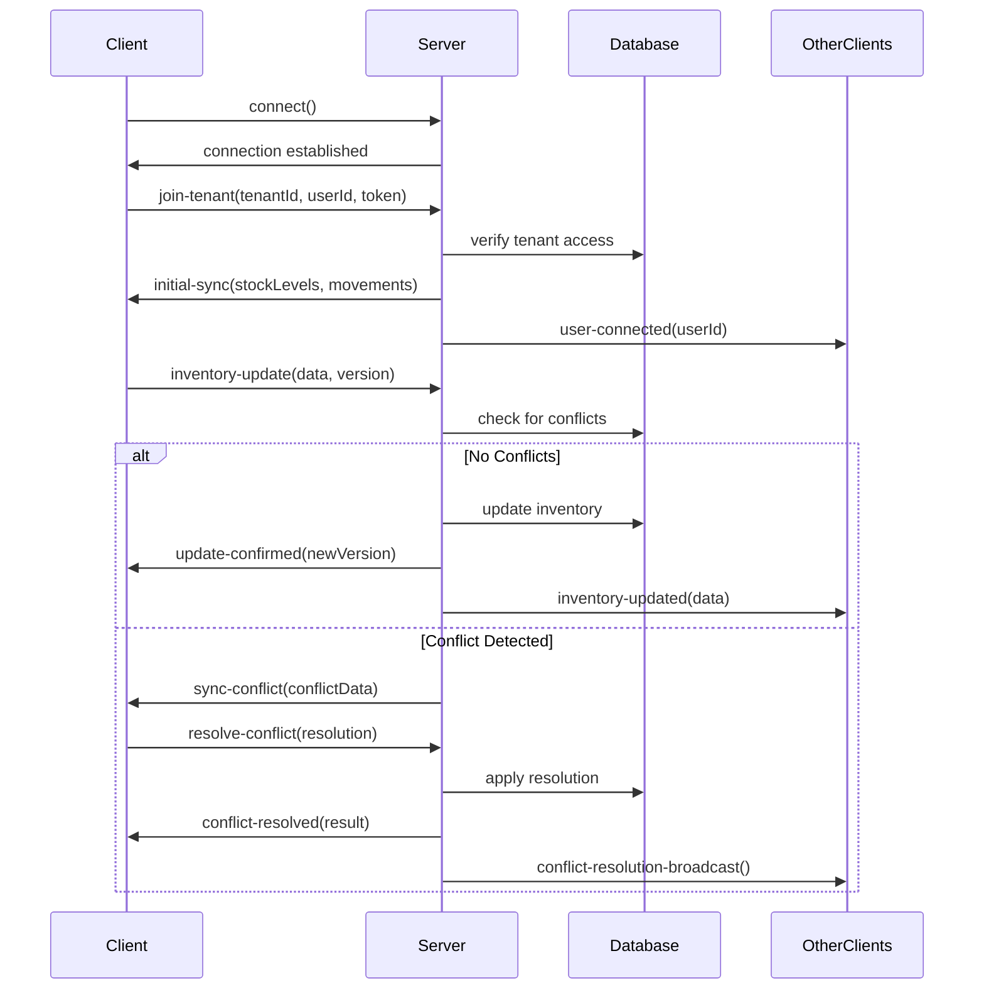
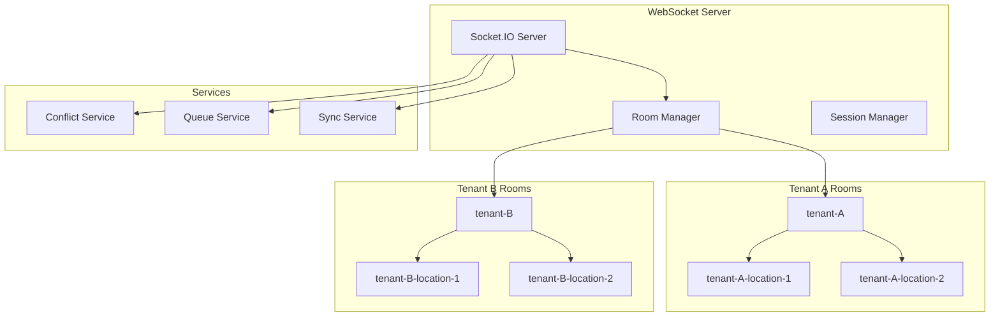
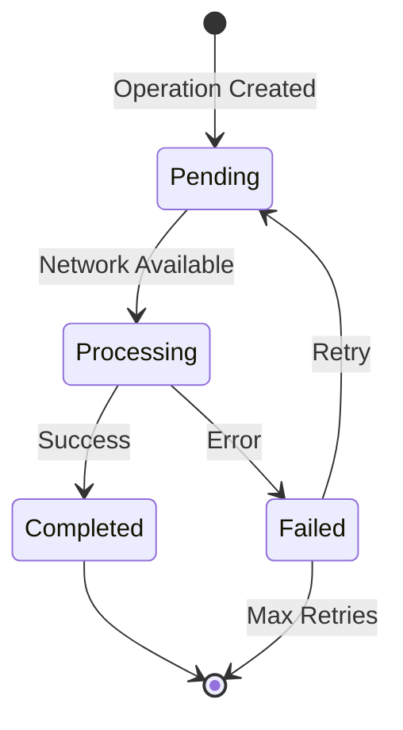

# Enhanced Real-time Synchronization System

## Overview

The Enhanced Real-time Synchronization System provides tenant-aware real-time updates, conflict resolution, and offline queue management for the Smart Inventory & Billing Management System. It ensures data consistency across multiple users and locations within tenant boundaries while handling network interruptions gracefully.

## Key Features

### 1. Tenant-Based Room Management
- Automatic tenant isolation for all real-time communications
- Location-specific room filtering within tenant scope
- User session tracking with tenant context
- Secure room joining with access verification

### 2. Real-time Inventory Synchronization
- Instant inventory updates across all tenant users
- Version-controlled updates with conflict detection
- Location-based update filtering
- Automatic stock level broadcasting

### 3. Conflict Resolution System
- Automatic conflict detection for concurrent updates
- Multiple resolution strategies (accept local, accept server, merge)
- User-driven conflict resolution interface
- Audit trail for all conflict resolutions

### 4. Offline Queue Management
- Automatic queuing of operations during network interruptions
- Intelligent retry mechanisms with exponential backoff
- Batch processing of queued operations
- Status tracking for all queued items

### 5. Advanced Synchronization Features
- Initial sync data delivery on connection
- Periodic sync state updates
- Network status monitoring
- Performance metrics and health monitoring

## Architecture

### WebSocket Communication Flow



### Tenant Isolation Architecture



## WebSocket Events

### Client to Server Events

#### join-tenant
Join a tenant-specific room with authentication.

```typescript
socket.emit('join-tenant', {
  tenantId: string,
  userId: string,
  token: string,
  locationId?: string
});
```

#### inventory-update
Send real-time inventory update with version control.

```typescript
socket.emit('inventory-update', {
  productId: string,
  locationId: string,
  newQuantity: number,
  previousQuantity?: number,
  version?: number,
  eventId?: string
});
```

#### sync-offline-queue
Synchronize offline queue items.

```typescript
socket.emit('sync-offline-queue', [
  {
    id: string,
    operation: 'create' | 'update' | 'delete',
    resourceType: string,
    resourceId?: string,
    data: any,
    timestamp: Date
  }
]);
```

#### resolve-conflict
Resolve a synchronization conflict.

```typescript
socket.emit('resolve-conflict', {
  conflictId: string,
  resolution: 'accept_local' | 'accept_server' | 'merge',
  mergedData?: any
});
```

#### network-status
Report network connectivity status.

```typescript
socket.emit('network-status', {
  isOnline: boolean
});
```

### Server to Client Events

#### initial-sync
Initial synchronization data on connection.

```typescript
socket.on('initial-sync', (data: {
  stockLevels: StockLevel[],
  recentMovements: StockMovement[],
  syncTimestamp: Date,
  tenantId: string,
  locationId?: string
}) => {
  // Handle initial sync data
});
```

#### inventory-updated
Real-time inventory update broadcast.

```typescript
socket.on('inventory-updated', (data: {
  productId: string,
  locationId: string,
  newQuantity: number,
  updatedBy: string,
  timestamp: Date,
  version: number
}) => {
  // Update local inventory state
});
```

#### sync-conflict
Conflict detected, requires resolution.

```typescript
socket.on('sync-conflict', (conflict: {
  id: string,
  tenantId: string,
  resourceType: string,
  resourceId: string,
  conflictType: string,
  localVersion: any,
  serverVersion: any,
  timestamp: Date
}) => {
  // Present conflict resolution UI
});
```

#### update-confirmed
Confirmation of successful update.

```typescript
socket.on('update-confirmed', (data: {
  eventId: string,
  newVersion: number,
  timestamp: Date
}) => {
  // Update local version tracking
});
```

#### offline-sync-results
Results of offline queue processing.

```typescript
socket.on('offline-sync-results', (results: Array<{
  id: string,
  success: boolean,
  result?: any,
  error?: string
}>) => {
  // Handle sync results
});
```

## REST API Endpoints

### Synchronization State

#### GET /api/v1/realtime/sync-state
Get current synchronization state for tenant.

**Response:**
```json
{
  "success": true,
  "data": {
    "syncState": {
      "tenantId": "string",
      "lastSyncTimestamp": "2024-01-01T00:00:00Z",
      "pendingOperations": 0,
      "conflictCount": 0,
      "onlineUsers": 5
    },
    "connectedUsers": 5,
    "timestamp": "2024-01-01T00:00:00Z"
  }
}
```

#### POST /api/v1/realtime/broadcast
Broadcast real-time event to tenant users.

**Request:**
```json
{
  "type": "inventory_update",
  "data": {
    "productId": "string",
    "message": "string"
  },
  "locationId": "string (optional)",
  "eventId": "string (optional)"
}
```

### Offline Queue Management

#### POST /api/v1/realtime/offline-queue
Process offline queue items for synchronization.

**Request:**
```json
{
  "items": [
    {
      "id": "string",
      "operation": "update",
      "resourceType": "stock_level",
      "resourceId": "string",
      "data": {},
      "timestamp": "2024-01-01T00:00:00Z",
      "locationId": "string (optional)"
    }
  ]
}
```

### Conflict Management

#### GET /api/v1/realtime/conflicts
Get pending synchronization conflicts for user.

#### POST /api/v1/realtime/resolve-conflict
Resolve a synchronization conflict.

**Request:**
```json
{
  "conflictId": "string",
  "resolution": "accept_server",
  "mergedData": {} // optional for merge resolution
}
```

### System Health

#### GET /api/v1/realtime/health
Get real-time system health and statistics.

**Response:**
```json
{
  "success": true,
  "data": {
    "system": {
      "totalConnections": 25,
      "activeTenants": 5,
      "averageConnectionsPerTenant": 5.0
    },
    "tenant": {
      "id": "string",
      "connectedUsers": 5,
      "syncState": {}
    },
    "timestamp": "2024-01-01T00:00:00Z"
  }
}
```

#### POST /api/v1/realtime/ping
Ping endpoint for connection testing and latency measurement.

## Data Models

### Sync Conflict
```typescript
interface SyncConflict {
  id: string;
  tenantId: string;
  resourceType: 'stock_level' | 'product' | 'transaction';
  resourceId: string;
  conflictType: 'concurrent_update' | 'version_mismatch' | 'data_inconsistency';
  localVersion: any;
  serverVersion: any;
  timestamp: Date;
  userId: string;
  locationId?: string;
}
```

### Offline Queue Item
```typescript
interface OfflineQueueItem {
  id: string;
  tenantId: string;
  userId: string;
  locationId?: string;
  operation: 'create' | 'update' | 'delete';
  resourceType: string;
  resourceId?: string;
  data: any;
  timestamp: Date;
  retryCount: number;
  status: 'pending' | 'processing' | 'completed' | 'failed';
}
```

### Tenant Sync State
```typescript
interface TenantSyncState {
  tenantId: string;
  lastSyncTimestamp: Date;
  pendingOperations: number;
  conflictCount: number;
  onlineUsers: number;
  locations: Map<string, LocationSyncState>;
}
```

## Conflict Resolution Strategies

### 1. Accept Local (Client Wins)
- Client's version is accepted as authoritative
- Server data is overwritten with client data
- Other clients receive the client's update
- Use when client has more recent or accurate data

### 2. Accept Server (Server Wins)
- Server's version is accepted as authoritative
- Client data is discarded
- Client receives server's current data
- Use when server has more authoritative data

### 3. Merge
- Combine both versions intelligently
- User provides merged data
- Merged result is applied to server
- Use when both versions have valuable changes

## Offline Queue Management

### Queue Processing Flow

1. **Network Interruption Detection**
   - Client detects network loss
   - Switches to offline mode
   - Queues all operations locally

2. **Operation Queuing**
   - Operations stored with timestamps
   - Retry count tracking
   - Status monitoring

3. **Network Recovery**
   - Client detects network restoration
   - Sends queued operations to server
   - Server processes operations in order

4. **Conflict Resolution**
   - Server checks for conflicts during processing
   - Conflicts sent back to client for resolution
   - Resolved operations applied to server

### Queue Item Lifecycle



## Performance Optimizations

### Connection Management
- Connection pooling for WebSocket connections
- Automatic reconnection with exponential backoff
- Heartbeat monitoring for connection health
- Resource cleanup on disconnection

### Event Batching
- Batch multiple updates into single events
- Configurable batch size and timeout
- Reduced network overhead
- Improved performance for high-frequency updates

### Memory Management
- Automatic cleanup of old events
- Configurable retention periods
- Memory usage monitoring
- Garbage collection optimization

## Security Features

### Authentication & Authorization
- JWT token validation for WebSocket connections
- Tenant access verification
- User permission checking
- Session management with timeout

### Data Protection
- Tenant data isolation
- Encrypted WebSocket connections (WSS)
- Input validation and sanitization
- Rate limiting for events

### Audit & Monitoring
- Complete audit trail for all operations
- Security event logging
- Anomaly detection
- Performance monitoring

## Error Handling

### Connection Errors
- Automatic reconnection attempts
- Exponential backoff strategy
- Connection state management
- User notification of connection issues

### Synchronization Errors
- Conflict detection and resolution
- Data validation errors
- Version mismatch handling
- Rollback mechanisms

### Queue Processing Errors
- Retry mechanisms with limits
- Error categorization
- Dead letter queue for failed items
- User notification of failures

## Testing

### Test Coverage
- Unit tests for all service methods
- Integration tests for WebSocket events
- End-to-end tests for sync workflows
- Performance tests for high load scenarios

### Test Script
Run the comprehensive test suite:
```bash
npx ts-node src/scripts/testRealtimeSync.ts
```

## Monitoring & Metrics

### Key Metrics
- Connection count per tenant
- Event frequency and latency
- Conflict resolution rates
- Queue processing performance
- Error rates and types

### Health Checks
- WebSocket server health
- Database connectivity
- Memory usage
- CPU utilization
- Network latency

## Best Practices

### Client Implementation
1. Implement proper connection management
2. Handle network interruptions gracefully
3. Provide user feedback for sync status
4. Implement conflict resolution UI
5. Cache data locally for offline access

### Server Configuration
1. Set appropriate connection limits
2. Configure proper timeout values
3. Implement rate limiting
4. Monitor resource usage
5. Set up proper logging and alerting

### Performance Optimization
1. Use event batching for high-frequency updates
2. Implement proper caching strategies
3. Monitor and optimize database queries
4. Use compression for large payloads
5. Implement proper cleanup mechanisms

## Troubleshooting

### Common Issues

#### Connection Problems
- Check network connectivity
- Verify authentication tokens
- Review firewall settings
- Check server capacity

#### Sync Issues
- Verify tenant permissions
- Check for version conflicts
- Review queue processing logs
- Validate data integrity

#### Performance Issues
- Monitor connection counts
- Check event frequency
- Review memory usage
- Analyze database performance

### Debug Tools
- Real-time event monitoring
- Connection state inspection
- Queue status checking
- Performance metrics dashboard
- Error log analysis